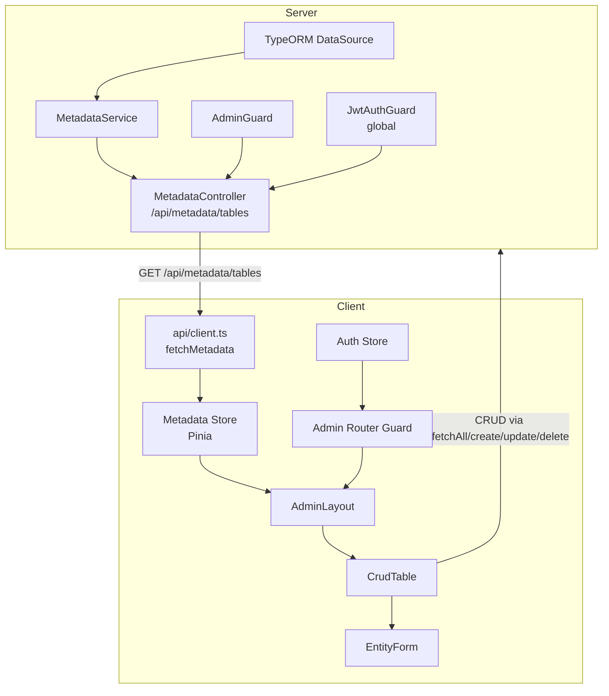
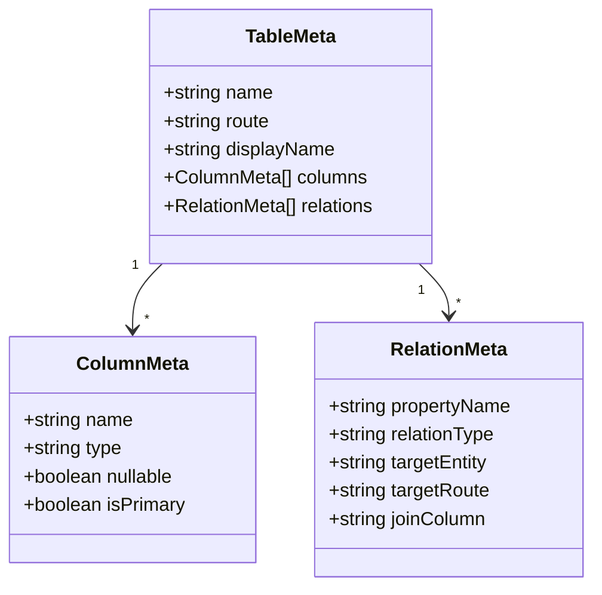
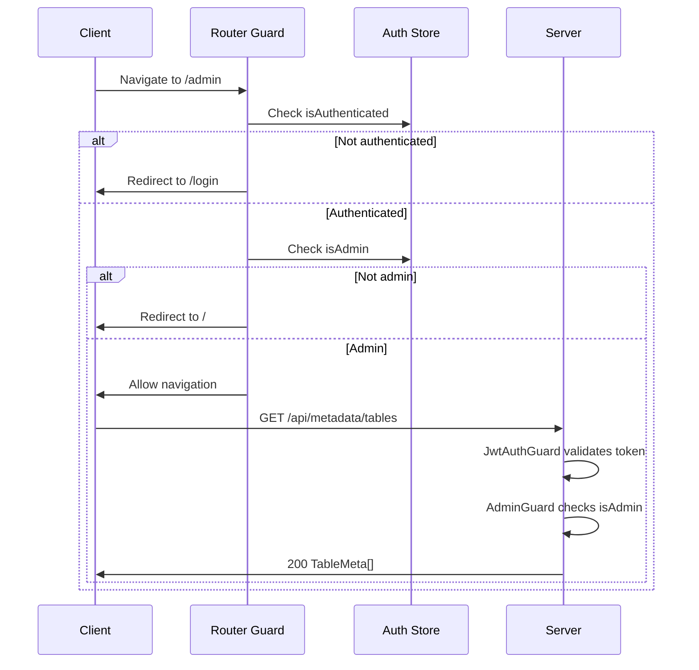

# Design Document: Admin CRUD Editor

## Overview

The Admin CRUD Editor ports the phase 1 admin app's metadata-driven CRUD functionality into the phase 2 project, gated behind admin authentication. The system introspects TypeORM entity metadata at runtime to auto-generate table views and forms — no per-entity frontend code required.

The design spans four layers:

1. **Server metadata** — A NestJS service that reads TypeORM's `DataSource.entityMetadatas` and exposes table descriptors via a guarded API endpoint.
2. **Server authorization** — An `AdminGuard` that restricts admin endpoints to players with `isAdmin: true`.
3. **Client state** — A Pinia metadata store that fetches, caches, and classifies table metadata.
4. **Client UI** — An admin layout with sidebar navigation, a reusable `CrudTable` component, and a reusable `EntityForm` component.

### Key Design Decisions

- **Auto-derived routes**: The phase 1 metadata service used a hardcoded `ROUTE_MAP` to map entity names to API routes. This design eliminates that map by deriving routes algorithmically: PascalCase entity name → kebab-case → pluralized. This means new entities are automatically available without touching the metadata service.
- **Lazy-loaded admin bundle**: All admin routes use dynamic imports so non-admin users never download admin component code.
- **Phase 1 as reference, not dependency**: The phase 1 `CrudTable`, `EntityForm`, and metadata store are ported and adapted to phase 2's conventions (TypeScript strict mode, `.js` import extensions, JWT auth headers, PrimeVue 4 API). No runtime dependency on phase 1.

## Architecture



### Request Flow

1. Admin user navigates to `/admin` → Vue Router's admin guard checks `authStore.isAdmin`.
2. `AdminLayout` mounts → calls `metadataStore.load()` → fetches `/api/metadata/tables`.
3. Server: `JwtAuthGuard` validates JWT → `AdminGuard` checks `player.isAdmin` → `MetadataService.getAll()` introspects TypeORM entities → returns table descriptors.
4. Client: metadata store caches the response, groups tables by category.
5. `AdminLayout` renders sidebar with grouped tables. Clicking a table navigates to `/admin/:table`.
6. `CrudTable` receives table metadata, fetches paginated records from the table's derived route, renders columns from metadata.
7. Create/edit opens a dialog with `EntityForm`, which renders fields from column metadata and FK dropdowns from relation metadata.

## Components and Interfaces

### Server Components

#### MetadataService

**Location**: `server/modules/metadata/metadata.service.ts`

Introspects `DataSource.entityMetadatas` to produce `TableMeta[]`. Key differences from phase 1:

- **No `ROUTE_MAP`**: Routes are derived by a `toRoute()` function that converts PascalCase to kebab-case and pluralizes.
- **`toRoute()` algorithm**: Split on uppercase boundaries → lowercase → join with hyphens → append 's' (with standard English pluralization rules for common suffixes: -s, -x, -z, -ch, -sh → 'es'; -y after consonant → 'ies').
- **`toDisplayName()`**: Insert spaces before uppercase letters (same as phase 1).
- Filters out `createdAt` and `updatedAt` columns.
- Maps TypeORM column types to simplified string types.
- Maps relations including `joinColumn` database name for FK identification.

```typescript
interface ColumnMeta {
  name: string;       // property name (camelCase)
  type: string;       // simplified type: 'string' | 'number' | 'boolean' | 'text'
  nullable: boolean;
  isPrimary: boolean;
}

interface RelationMeta {
  propertyName: string;   // relation property name
  relationType: string;   // 'many-to-one' | 'one-to-many' | 'many-to-many'
  targetEntity: string;   // target entity class name
  targetRoute: string;    // derived API route for the target entity
  joinColumn?: string;    // FK column database name (for many-to-one)
}

interface TableMeta {
  name: string;          // entity class name (PascalCase)
  route: string;         // derived API route (kebab-case, plural)
  displayName: string;   // human-readable name
  columns: ColumnMeta[];
  relations: RelationMeta[];
}
```

#### MetadataController

**Location**: `server/modules/metadata/metadata.controller.ts`

Single endpoint: `GET /api/metadata/tables`. Protected by `AdminGuard` (applied via `@UseGuards(AdminGuard)` on the controller class).

#### MetadataModule

**Location**: `server/modules/metadata/metadata.module.ts`

Imports nothing beyond NestJS core — `DataSource` is available globally via TypeORM. Exports `MetadataService` for potential reuse.

#### AdminGuard

**Location**: `server/guards/admin.guard.ts`

A NestJS `CanActivate` guard that reads `request.user` (populated by the global `JwtAuthGuard` + `JwtStrategy`) and checks `player.isAdmin === true`. Returns `true` or throws `ForbiddenException`.

```typescript
@Injectable()
export class AdminGuard implements CanActivate {
  canActivate(context: ExecutionContext): boolean {
    const request = context.switchToHttp().getRequest();
    const player = request.user;
    if (!player?.isAdmin) {
      throw new ForbiddenException('Admin access required');
    }
    return true;
  }
}
```

### Client Components

#### Metadata Store

**Location**: `client/stores/metadata.ts`

Pinia store that fetches and caches table metadata. Ported from phase 1 with these adaptations:

- Uses the phase 2 API client (which injects JWT auth headers).
- `fetchMetadata()` function added to `client/api/client.ts`.
- `getGroupedTables()` returns tables organized by category using a static `CATEGORY_MAP` (same categories as phase 1: Combat, Equipment, Crafting, Characters, Lookup Tables).
- `getTableType()` classifies tables as `'Canon'` or `'Dynamic'` using a static `DYNAMIC_ROUTES` set.
- `getTable(route)` returns a single table descriptor by route.

#### AdminLayout

**Location**: `client/views/admin/AdminLayout.vue`

Layout component with:
- **Sidebar**: Lists all tables grouped by `Table_Category`. Each table name is a `<router-link>` to `/admin/:route`. Canon tables shown normally; Dynamic tables shown with a visual indicator (e.g., a lightning bolt icon or different text color).
- **Content area**: `<router-view>` that renders the `CrudTable` for the selected table.
- On mount, loads metadata store and redirects to the first table if no table is selected.

#### AdminTableView

**Location**: `client/views/admin/AdminTableView.vue`

Thin wrapper that reads the `:table` route param, looks up the table metadata from the store, and passes it to `CrudTable`. Handles the case where the table route is invalid (redirects to first available table).

#### CrudTable

**Location**: `client/components/CrudTable.vue`

Ported from phase 1. PrimeVue `DataTable` with lazy pagination and server-side sorting. Key behaviors:

- Receives `tableMeta: TableMeta` as a prop.
- Fetches paginated data from `/${tableMeta.route}` using the API client.
- Renders columns from `tableMeta.columns`, excluding PKs. FK ID columns that have a corresponding relation are hidden — the relation column shows the related entity's `name` or `id` instead.
- Boolean columns render as check/cross icons.
- "New" button opens a dialog with `EntityForm` in create mode.
- Row edit button opens a dialog with `EntityForm` in edit mode, pre-populated.
- Row delete button shows a PrimeVue `ConfirmDialog` before calling `deleteEntity()`.
- Watches `tableMeta.route` — when it changes, resets pagination to page 1 and reloads.

#### EntityForm

**Location**: `client/components/EntityForm.vue`

Ported from phase 1. Auto-generates form fields from table metadata:

- Renders fields for all columns except `id`, `createdAt`, `updatedAt`.
- Skips FK ID columns that have a corresponding relation (renders a dropdown instead).
- Input type mapping: `string` → `InputText`, `number` → `InputNumber`, `boolean` → `Checkbox`, `text` → `Textarea`.
- ManyToOne relations → PrimeVue `Select` dropdown, populated by fetching all records from the related entity's route (limit 500).
- Create mode: boolean fields default to `false`, others empty.
- Edit mode: all fields pre-populated from the entity data.
- Emits `save` event with form data, `cancel` event to close.

#### Admin Router Guard

Implemented as a `beforeEnter` guard on the `/admin` route (not a global guard). Logic:

1. If not authenticated → redirect to `/login`.
2. If authenticated but not admin → redirect to `/` (home).
3. If admin → allow navigation.

#### Router Configuration

```typescript
{
  path: '/admin',
  component: () => import('@/views/admin/AdminLayout.vue'),
  beforeEnter: adminGuard,
  children: [
    {
      path: ':table',
      name: 'admin-table',
      component: () => import('@/views/admin/AdminTableView.vue'),
    },
  ],
}
```

All admin components use dynamic `() => import()` for code splitting.

#### Admin Navigation Item

Added to `App.vue` (or a shared layout component): a conditional `<router-link to="/admin">` visible only when `authStore.isAdmin` is `true`.

## Data Models

### Server-Side Types

The metadata service produces `TableMeta[]` from TypeORM's internal `EntityMetadata`. No new database tables are created — the service reads existing TypeORM metadata at runtime.



### Client-Side Types

The client mirrors the server types in `client/api/client.ts`:

```typescript
export interface ColumnMeta {
  name: string;
  type: string;
  nullable: boolean;
  isPrimary: boolean;
}

export interface RelationMeta {
  propertyName: string;
  relationType: string;
  targetEntity: string;
  targetRoute: string;
  joinColumn?: string;
}

export interface TableMeta {
  name: string;
  route: string;
  displayName: string;
  columns: ColumnMeta[];
  relations: RelationMeta[];
}
```

### Table Classification Data

The metadata store contains two static data structures:

1. **`CATEGORY_MAP`**: Maps route strings to category names. Same data as phase 1's metadata store. Tables not in the map default to "Lookup Tables".

2. **`DYNAMIC_ROUTES`**: A `Set<string>` of routes that are dynamic tables (e.g., `'players'`, `'characters'`, `'inventories'`). Tables not in the set are classified as Canon. Same data as phase 1's `TABLE_TYPE_MAP`.

These are static because the classification is a domain concept that doesn't change at runtime.

## Correctness Properties

*A correctness property is a characteristic or behavior that should hold true across all valid executions of a system — essentially, a formal statement about what the system should do. Properties serve as the bridge between human-readable specifications and machine-verifiable correctness guarantees.*

### Test Case 1: Route derivation produces kebab-case plural strings

When any PascalCase entity class name is passed to the `toRoute()` function, the result should be a lowercase kebab-case pluralized string with no uppercase letters, no consecutive hyphens, and ending in a valid English plural suffix.

**Validates: Requirements 1.2**

### Test Case 2: Timestamp columns are excluded from metadata

When the metadata service produces table descriptors for any set of registered entities, no table descriptor's column list should contain entries named `createdAt` or `updatedAt`.

**Validates: Requirements 1.3**

### Test Case 3: Metadata descriptors are complete

When the metadata service produces a table descriptor, every column object should contain `name`, `type`, `nullable`, and `isPrimary` fields, and every relation object should contain `propertyName`, `relationType`, `targetEntity`, and `targetRoute` fields.

**Validates: Requirements 1.4, 1.5**

### Test Case 4: Form excludes non-editable columns

When the EntityForm component receives any table metadata, it should render form fields for all columns except those where `isPrimary` is true or the name is `createdAt` or `updatedAt`.

**Validates: Requirements 7.1**

## Error Handling

### Server Errors

| Scenario | Response | Handler |
|---|---|---|
| Unauthenticated request to `/api/metadata/tables` | 401 Unauthorized | Global `JwtAuthGuard` |
| Non-admin request to `/api/metadata/tables` | 403 Forbidden | `AdminGuard` |
| CRUD entity not found | 404 Not Found | `BaseCrudService.findOne()` |
| CRUD validation failure | 400 Bad Request | NestJS validation pipe (if DTOs are used) |
| Database error during CRUD | 500 Internal Server Error | NestJS default exception filter |

### Client Errors

| Scenario | Handling |
|---|---|
| 401 from any API call | Axios interceptor clears auth state, redirects to login |
| 403 from metadata endpoint | Toast error message, admin layout shows empty state |
| API error during CRUD operation | Toast error with server message (`e.response?.data?.message`) |
| Invalid table route param | `AdminTableView` redirects to first available table |
| Relation dropdown fetch fails | Dropdown shows empty options, no crash |

### Guard Error Flow



## Testing Strategy

### Unit Tests

**Server — MetadataService** (`server/modules/metadata/metadata.service.spec.ts`):
- `toRoute()` function: test with representative PascalCase names (single word, multi-word, names ending in -y, -s, -x, -ch, -sh) to verify kebab-case pluralization.
- `toDisplayName()` function: test PascalCase → spaced display name conversion.
- `getAll()`: mock `DataSource.entityMetadatas` with a test entity containing known columns and relations. Verify returned `TableMeta` has correct structure, excludes `createdAt`/`updatedAt`, and derives route correctly.

**Server — AdminGuard** (`server/guards/admin.guard.spec.ts`):
- Test with admin player → returns `true`.
- Test with non-admin player → throws `ForbiddenException`.
- Test with no user on request → throws `ForbiddenException`.

**Client — Metadata Store** (`client/stores/metadata.spec.ts`):
- `load()`: mock API, verify tables are populated.
- `load()` called twice: verify API called only once (caching).
- `getTable()`: verify correct table returned by route.
- `getGroupedTables()`: verify tables grouped under correct categories.
- `getTableType()`: verify Canon vs Dynamic classification.

**Client — CrudTable** (`client/components/CrudTable.spec.ts`):
- Renders columns from metadata (excluding PKs).
- Boolean columns render as icons.
- Relation columns show entity name, not FK ID.
- Pagination triggers API call with correct params.
- Sort triggers API call with sortBy/sortOrder.
- New button opens dialog in create mode.
- Table route change resets pagination and reloads.

**Client — EntityForm** (`client/components/EntityForm.spec.ts`):
- Renders correct input types per column type.
- Excludes id, createdAt, updatedAt fields.
- Create mode: booleans default to false.
- Edit mode: fields pre-populated.
- FK relations render as Select dropdowns.
- Submit emits save event with form data.

### Integration Tests (E2E with Playwright)

- Admin login → navigate to `/admin` → verify sidebar loads with table categories.
- Click a table → verify data loads in the table view.
- Create a record → verify it appears in the table.
- Edit a record → verify changes persist.
- Delete a record with confirmation → verify it's removed.
- Non-admin user → verify redirect away from `/admin`.

### Test Configuration

- **Runner**: Vitest (`npm test` / `vitest --run`)
- **Environment**: jsdom with globals enabled
- **Server tests**: Mock TypeORM Repository/DataSource, instantiate service directly
- **Client tests**: `@vue/test-utils` for component mounting, mock Pinia stores and API calls
- **E2E tests**: Playwright against full stack (`npm run test:e2e`)
